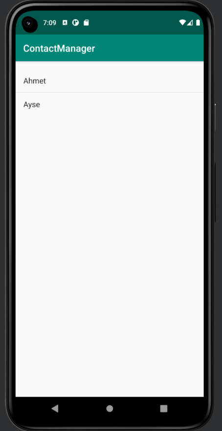

# AndroidSQLite

This is a representation of SQLite usage in android environment in Java language. This project includes all CRUD (Create, Read, Update and Delete) operations. 

## License

**Free Software, Really**
